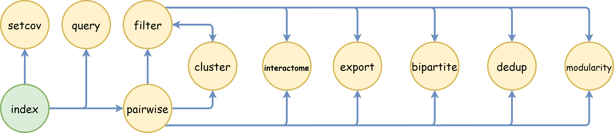

# Welcome to the DBRetina documentation

## DBRetina introduction

DBRetina is a powerful tool designed to calculate pairwise distances between numerous entities, such as diseases or molecular experiments, based on their shared features, such as genes. DBRetina provides valuable insights for researchers and professionals in various fields by identifying similarities between entries in a given database.

For instance, in the context of a disease database, each disease is associated with a set of risk genes. DBRetina calculates the pairwise distance between all diseases in the database by analyzing the number of shared genes between each pair of diseases. This information can be used to identify closely related diseases or uncover underlying patterns in the data.

DBRetina streamlines the analysis of complex relationships within databases by leveraging advanced indexing and querying techniques. Its versatile and efficient design allows users to work with various data types and structures, making it a valuable tool for understanding and interpreting complex biological and molecular associations.

## DBRetina's commands chaining

**The commands can be chained together as follows:**

1. Index → Pairwise: The output from the Index command can be used as input for the Pairwise command.

2. Pairwise → Filter, Cluster, Export: The output from the Pairwise command can be used as input for the Filter, Cluster, or Export commands.

3. Filter → Cluster, Export: The output from the Filter command can be used as input for the Cluster or Export commands.

4. Cluster → Filter: The output from the Cluster command can be used as input for the Filter command.

This chaining allows for a seamless flow of data from one stage of processing to another, improving efficiency and ease of use.

Please note that the arrow (-->) denotes the direction of data flow from the output of one command to the input of the next.
