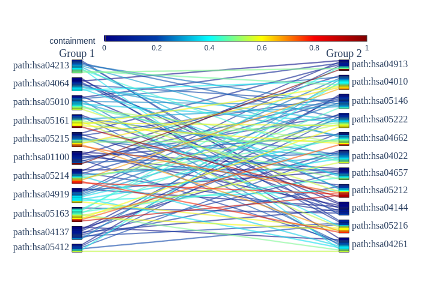

# Bipartite

The Bipartite command will create a bipartite graph from a pairwise TSV file between two groups files.

```
Usage: DBRetina bipartite [OPTIONS]

  Create a bipartite connections between two group files.

Options:
  -p, --pairwise PATH  the pairwise TSV file  [required]
  --group1 PATH        group1 single-column supergroups file
  --group2 PATH        group2 single-column supergroups file
  --gmt1 PATH          GMT file 1
  --gmt2 PATH          GMT file 2
  -m, --metric TEXT    select from ['containment', 'ochiai', 'jaccard',
                       'pvalue']  [required]
  -o, --output TEXT    output file prefix  [required]
  --help               Show this message and exit.
```

## Command arguments

<span class="cmd">  -p, --pairwise PATH  the pairwise TSV file  [required] </span>

The original or a filtered pairwise TSV file.

<span class="cmd"> --group1 PATH        group1 single-column supergroups file </span>

A single-column file with the group1 supergroups.

<span class="cmd"> --group2 PATH        group2 single-column supergroups file </span>

A single-column file with the group2 supergroups.

<span class="cmd"> --gmt1 PATH          GMT file 1 </span>

A GMT file with the group1 supergroups.

<span class="cmd"> --gmt2 PATH          GMT file 2 </span>

A GMT file with the group2 supergroups.

!!! warning
      <b>You can't use combination of gmt files and single-column group files, the command accepts only one type of input.</b>


<span class="cmd"> -m, --metric TEXT    select from ['containment', 'ochiai', 'jaccard', 'pvalue']  [required] </span>

The similarity metric that will be used to create the bipartite graph.

<span class="cmd"> -o, --output TEXT    output prefix  [required] </span>

The output files prefix.


<hr class="fancy-hr">


## Output files format

<span class="cmd"> {output_prefix}_bipartite_pairwise.tsv </span>

A pairwise TSV file with the bipartite connections.

<span class="cmd"> {output_prefix}_bipartite.html </span>

An interactive bipartite graph in HTML format.

<span class="cmd"> {output_prefix}_bipartite.png </span>

A bipartite graph in PNG format.

<span class="cmd"> {output_prefix}_missing_groups.txt </span>

If there are missing groups in the group files, they will be reported in this file.


=== "Interactive Bipartite graph"

    <iframe src="../../assets/images/dbretina_bipartite/bipartite_output_prefix_bipartite.html" width="700" height="450" frameBorder="0">Browser not compatible.</iframe>


=== "Bipartite PNG plot"

    { align=left }
