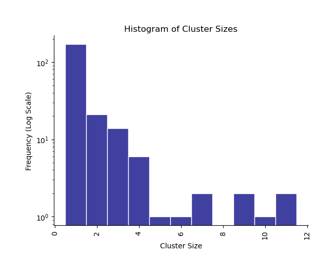
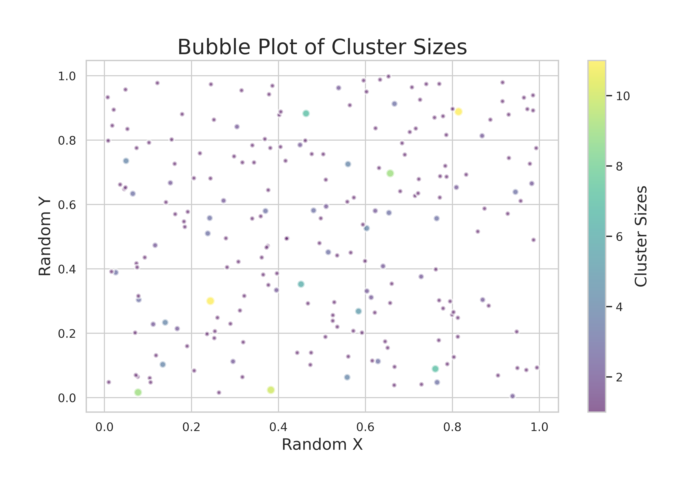

# Clustering the pairwise similarities

Graph-based clustering of the pairwise TSV file based on the connected components algorithm. The clustering is based on the similarity metric and the cutoff value. The output is a DBRetina clusters file.

```
Usage: DBRetina cluster [OPTIONS]

  Graph-based clustering of the pairwise TSV file.

Options:
  -p, --pairwise PATH       pairwise TSV file  [required]
  -m, --metric TEXT         select from ['containment', 'ochiai', 'jaccard',
                            'pvalue']  [required]
  --community               clusters as communities
  -c, --cutoff FLOAT RANGE  cluster the supergroups with (similarity > cutoff)
                            [0<=x<=100; required]
  -o, --output-prefix TEXT  output file prefix  [required]
  --help                    Show this message and exit.
```


## 4.1 Command arguments

<span class="cmd"> -c, --cutoff FLOAT RANGE  cluster the supergroups with (similarity > cutoff) [0<=x<=100; required] </span>

The cutoff value for clustering the supergroups. The default value is 0.0, which means that all comparisons are included in the clustering.

<span class="cmd"> -p, --pairwise PATH       pairwise TSV file  [required] </span>

The original pairwise TSV file generated from [`DBRetina pairwise`](dbretina_pairwise.md){:target="_blank"} command, or [`DBRetina filter`](dbretina_filter.md){:target="_blank"} command.

<span class="cmd"> -m, --metric TEXT         select from ['containment', 'ochiai', 'jaccard', 'pvalue']  [required] </span>

The similarity metric to apply the cutoff on.

<span class="cmd"> --community               clusters as communities </span>

<!-- TODO: Explain properly -->
This flag will cluster the supergroups by a community detection algorithm. The default is to cluster the supergroups using the weakly connected components algorithm.

<span class="cmd"> -o, --output-prefix TEXT  output file prefix  [required] </span>

The user-defined prefix for the output files.

<hr class="fancy-hr">

## 4.2 Output files format

<span class="cmd"> {output_prefix}_clusters.tsv </span>

The DBRetina clusters TSV file. First column is the cluster ID, second column is the cluster size, and the third column is PIPE separated cluster members.

<span class="cmd"> {output_prefix}_clusters_histogram.png </span>

A histogram provides of cluster sizes. Each bar corresponds to a size range, with a log-scale y-axis indicating the number of clusters falling within that range. This allows for a quick understanding of how cluster sizes are distributed, identifying common sizes and outliers.

<figure markdown>
  { width="400" }
  <figcaption>Example histogram plot</figcaption>
</figure>


<span class="cmd"> {output_prefix}_clusters_bubbles.png </span>

A Bubble plot uses a grid layout to represent distinct clusters. The bubble size and color gradient both denote the magnitude of each cluster. The bubble plot is useful for visualizing the distribution of cluster sizes and the relative sizes of each cluster.


<figure markdown>
  { width="400" }
  <figcaption>Example Bubble plot</figcaption>
</figure>