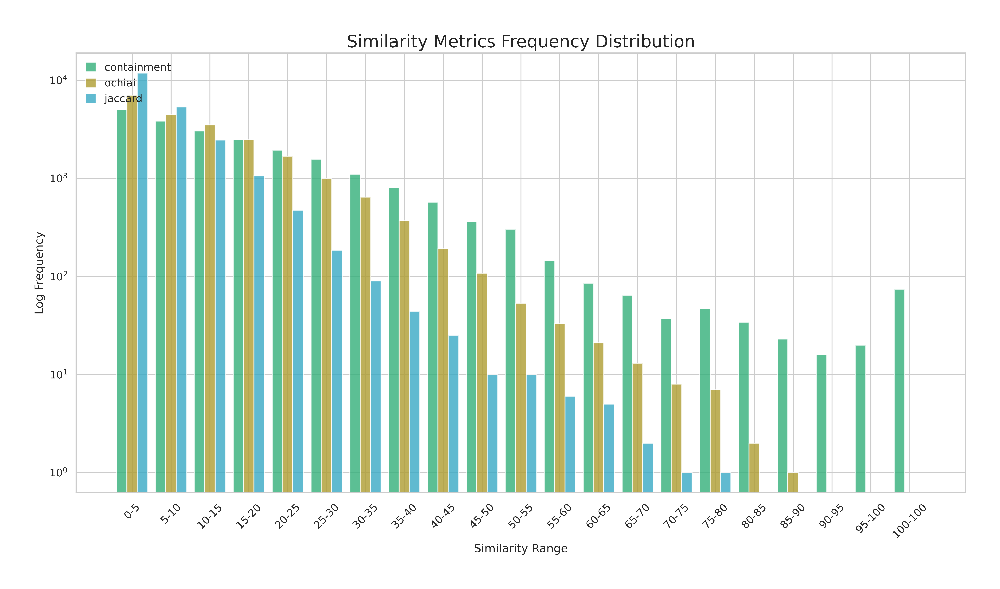
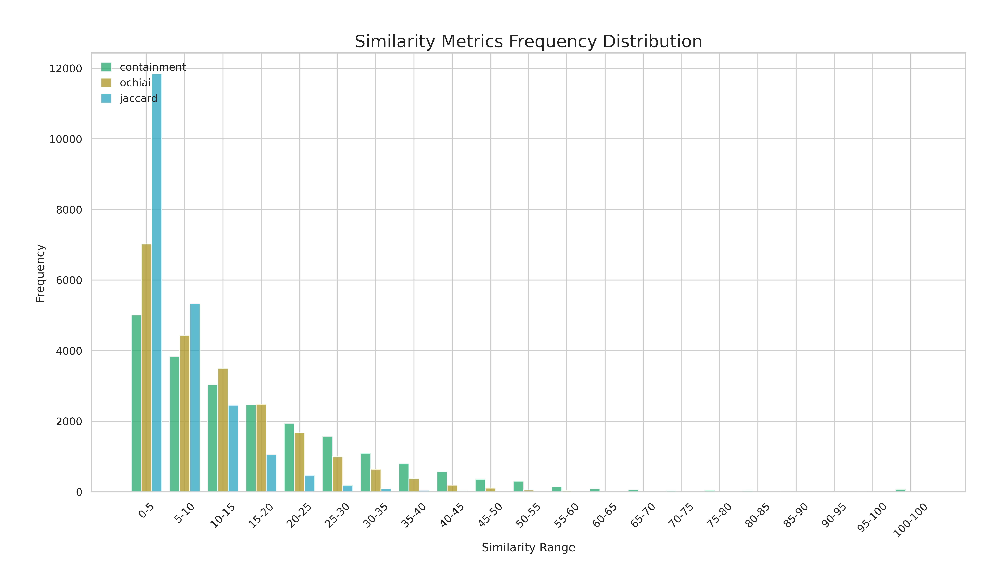

# Pairwise

The Pairwise command in DBRetina is designed to perform pairwise comparisons between supergroups based on their shared features. This command takes the index prefix and the number of cores as input parameters.


```
Usage: DBRetina pairwise [OPTIONS]

  Calculate pairwise similarities.

Options:
  -i, --index-prefix TEXT   Index file prefix  [required]
  -t, --threads INTEGER     number of cores  [default: 1]
  -m, --metric TEXT         select from ['containment', 'jaccard', 'ochiai']
  -c, --cutoff FLOAT RANGE  filter out similarities < cutoff  [default: 0.0;
                            0<=x<=100]
  --pvalue                  calculate Hypergeometric p-value
  --help                    Show this message and exit.
```

## Command arguments

<span class="cmd"> -i, --index-prefix TEXT   Index file prefix  [required] </span>

This is the user-defined prefix that was used in the indexing step as an output prefix.

<span class="cmd"> -t, --threads INTEGER     number of cores  [default: 1] </span>

The number of processing cores to be used for parallel computation during the pairwise comparisons.

<span class="cmd"> -m, --metric TEXT         select from ['containment', 'jaccard', 'ochiai'] </span>

Optional similarity metric to filter out pairwise comparisons below a certain cutoff from exporting.

<span class="cmd"> -c, --cutoff FLOAT RANGE filter out similarities < cutoff  [default: 0.0; 0<=x<=100] </span>

The `-c` argument is used with the `-m` argument to define the cutoff.

<span class="cmd"> --pvalue                  calculate Hypergeometric p-value </span>
This flag calculates the Hypergeometric p-value for pairwise comparisons based on shared features between supergroups and the total number of features in the database.

<hr class="fancy-hr">

## Output files

### Primary output files

<span class="cmd"> {index_prefix}_DBRetina_pairwise.tsv </span>

A TSV file that provides information about shared features between each pair of supergroups. The TSV columns are defined as follows:

<table>
  <tbody>
    <tr>
      <td><strong>group_1_ID</strong></td>
      <td>ID of the first supergroup in a pair</td>
    </tr>
    <tr>
      <td><strong>group_2_ID</strong></td>
      <td>ID of the second supergroup in a pair</td>
    </tr>
    <tr>
      <td><strong>group_1_name</strong></td>
      <td>name of the first supergroup in a pair</td>
    </tr>
    <tr>
      <td><strong>group_2_name</strong></td>
      <td>name of the second supergroup in a pair</td>
    </tr>
    <tr>
      <td><strong>shared_features</strong></td>
      <td>number of features shared between the two supergroups</td>
    </tr>
    <tr>
      <td><strong>containment</strong></td>
      <td>The containment metric is the ratio of shared kmers to the smallest set of kmers. This score is calculated as (shared_kmers / minimum_source_kmers) * 100.</td>
    </tr>
    <tr>
      <td><strong>ochiai</strong></td>
      <td>Ochiai similarity computed as 100 * (shared_kmers / sqrt(source_1_kmers * source_2_kmers))</td>
    </tr>
    <tr>
      <td><strong>jaccard</strong></td>
      <td>Jaccard similarity percentage. calculated as 100 * (shared_kmers / (source_1_kmers + source_2_kmers - shared_kmers))</td>
    </tr>
    <tr>
      <td><strong>odds_ratio</strong></td>
      <td>The `odds_ratio` function calculates the odds ratio between two supergroups, quantifying the strength of association between them based on shared features. It returns a `double` representing the odds ratio, or `-1` if the calculation encounters a division by zero.</td>
    </tr>
    <tr>
      <td><strong>pvalue</strong></td>
      <td>This p-value quantifies the statistical significance of the overlap between the two supergroups, given their sizes and the universe of all features. Calculated from hypergeometric distribution.</td>
    </tr>
  </tbody>
</table>


<span class="cmd"> {index_prefix}_DBRetina_similarity_metrics_plot_log.png </span>

The clustered bar chart shows the logarithmic frequency distribution of three similarity metrics - containment, ochiai, and jaccard - over different similarity ranges.

<span class="cmd"> {index_prefix}_DBRetina_similarity_metrics_plot_linear.png </span>

Same as above, but the y-axis is displayed on a linear scale.


=== "Example plot (Log)"

    { align=left }


=== "Example plot (Linear)"

    { align=left }


??? info end "Advanced Output (For developers)"
    `{index_prefix}_DBRetina_pairwise_stats.json`: used to generate the similarity metrics plot.
    `{index_prefix}_DBRetina_pairwise_stats_odds_ratio.txt`: odds-ratio metadata for next step of commands.
