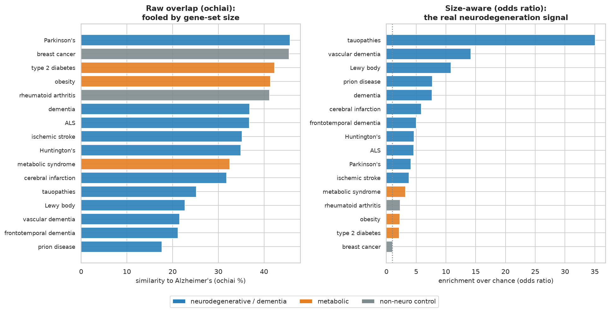

# What does Alzheimer's share genes with? (and why the metric matters)

Alzheimer's DisGeNET gene list is huge (~3,400 genes), and that size hides its true neighbours under raw overlap.
A size-aware metric recovers them. Full write-up:
<https://dbretina.github.io/DBRetina/examples/alzheimer-metric/>

## Data

17 disorders from DisGeNET (Piñero et al., 2017): Alzheimer's, a neurodegenerative group (Parkinson's, ALS,
Huntington's, dementia, frontotemporal dementia, Lewy body, tauopathies, prion), a vascular group (ischemic
stroke, cerebral infarction, vascular dementia), a metabolic group (type 2 diabetes, obesity, metabolic syndrome),
and two large controls. In `data/panel.gmt`; categories in `data/labels.json`.

## Reproduce

```bash
conda activate dbretina
bash run.sh
```

`run.sh` builds the index and pairwise, ranks Alzheimer's neighbours by `ochiai` (size-biased) and by `odds_ratio`
(size-aware) with `neighbors`, draws the odds-ratio network with `graph`, and runs `analyze.py` for the
before/after figure.

## Result

- **Raw overlap (ochiai) is fooled by size**: breast cancer (6,775 genes), type 2 diabetes, and obesity top the
  list, while the specific dementias sink to the bottom.
- **Odds ratio recovers the biology**: tauopathies (OR=35), vascular dementia, Lewy body, prion, dementia,
  frontotemporal dementia, Huntington's, ALS, and Parkinson's lead; breast cancer falls to OR=1.0 (chance).
- The shared genes are the canonical dementia set: APP, PSEN1, MAPT, APOE, GRN, SNCA.



The lesson: on gene sets of very different sizes, use a size-aware metric (odds ratio or p-value), not raw overlap.

## References

- Bellenguez C, et al. New insights into the genetic etiology of Alzheimer's disease and related dementias. *Nature Genetics* 2022;54(4):412-436. https://doi.org/10.1038/s41588-022-01024-z
- Piñero J, et al. DisGeNET. *Nucleic Acids Research* 2017;45(D1):D833-D839. https://doi.org/10.1093/nar/gkw943
