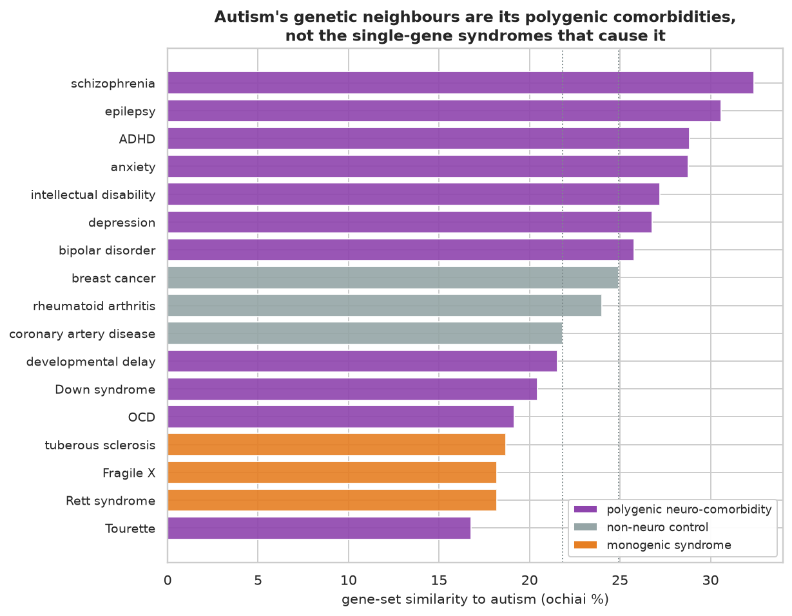

# Does autism's genetic overlap match its comorbidities?

Autism rarely occurs alone. This DBRetina workflow recovers its coexisting neuropsychiatric conditions from
gene lists, and separates the polygenic comorbidities from the single-gene syndromes that cause it. Full write-up:
<https://dbretina.github.io/DBRetina/examples/autism-comorbidity/>

## Data

18 disorders from DisGeNET (Piñero et al., 2017): autism, its neurodevelopmental comorbidities (epilepsy, ADHD,
intellectual disability, developmental delay), the psychiatric disorders (schizophrenia, bipolar, depression,
anxiety, OCD, Tourette), the monogenic syndromes (Rett, Fragile X, tuberous sclerosis, Down), and three non-neuro
controls. In `data/neuro.gmt` (names prefixed `dis_`); categories in `data/labels.json`.

## Reproduce

```bash
conda activate dbretina
bash run.sh
```

`run.sh` chains the workflow: `index` and `pairwise` build the network; `export` draws the dendrogram; `module`
reads autism's nearest disorders; `geneinfo` pulls the shared core across autism and its comorbidities; and
`analyze.py` ranks the neighbours, runs the polygenic-vs-control test, and writes the figure.

## Result

- **Autism's nearest disorders are its comorbidities.** `module` returns schizophrenia, epilepsy, ADHD, anxiety,
  intellectual disability, and depression, all documented autism comorbidities.
- **Comorbidity, not cause.** The seven polygenic psychiatric and neurodevelopmental comorbidities all rank above
  every non-neuro control (Mann-Whitney p = 0.008, autism-to-comorbidity 28.6% vs autism-to-control 23.6%). The
  monogenic syndromes (Rett, Fragile X, tuberous sclerosis) sit *below* the controls at 18.4%: single-gene
  disorders have small, specific gene sets that fall away from polygenic autism.
- **Shared core.** The genes shared across autism and its comorbidities are the synaptic and neurodevelopmental
  genes psychiatric exome studies keep finding: SHANK3, GRIN2B, GRIN2A, CNTNAP2, SYNGAP1, NRXN1, GABRB3, RELN.



## References

- Cross-Disorder Group of the Psychiatric Genomics Consortium. Genetic relationship between five psychiatric disorders estimated from genome-wide SNPs. *Nature Genetics* 2013;45(9):984-994. https://doi.org/10.1038/ng.2711
- Satterstrom FK, et al. Large-scale exome sequencing study implicates both developmental and functional changes in the neurobiology of autism. *Cell* 2020;180(3):568-584. https://doi.org/10.1016/j.cell.2019.12.036
- Piñero J, et al. DisGeNET. *Nucleic Acids Research* 2017;45(D1):D833-D839. https://doi.org/10.1093/nar/gkw943
