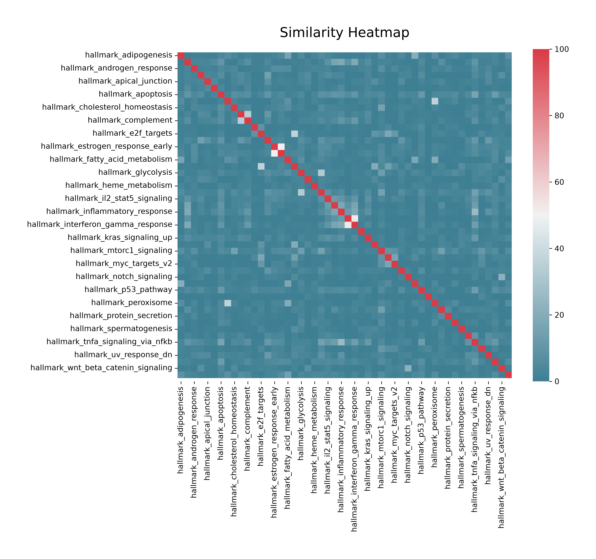

# Are the cancer Hallmarks really independent?

A worked DBRetina use case. Full write-up:
<https://dbretina.github.io/DBRetina/examples/hallmarks/>

## Question

The 50 MSigDB Hallmark gene sets were curated to be distinct cancer-related processes (Liberzon et al., 2015;
Hanahan & Weinberg, 2011). How independent are they, and what do the overlapping ones share?

## Data

The MSigDB Hallmark collection, `h.all.v2023.1.Hs.symbols.gmt`. It is not shipped here because MSigDB requires
registration; download it from <https://www.gsea-msigdb.org/gsea/msigdb/> and point `HALLMARK_GMT` at it (or edit
`run.sh`).

## Reproduce

```bash
conda activate dbretina
HALLMARK_GMT=/path/to/h.all.v2023.1.Hs.symbols.gmt bash run.sh
```

`run.sh` runs `index`, `pairwise`, and `export` (which draws the heatmap into `figures/`), then `shared-genes`
for the two overlapping pairs discussed in the write-up.

## Result

- Most Hallmark pairs are dissimilar; a few overlap. Top pairs by ochiai: interferon alpha / gamma (52%),
  estrogen late / early (50%), G2M checkpoint / E2F targets (37%).
- The interferon pair shares the interferon-stimulated genes (CXCL10/11, BST2, EIF2AK2, OAS family, ...); the
  cell-cycle pair shares the mitotic machinery (AURKA/B, CDK1/4, CDC25, CHEK1, BIRC5).



## References

- Liberzon A, et al. The Molecular Signatures Database hallmark gene set collection. *Cell Systems* 2015;1(6):417-425. https://doi.org/10.1016/j.cels.2015.12.004
- Hanahan D, Weinberg RA. Hallmarks of cancer: the next generation. *Cell* 2011;144(5):646-674. https://doi.org/10.1016/j.cell.2011.02.013
