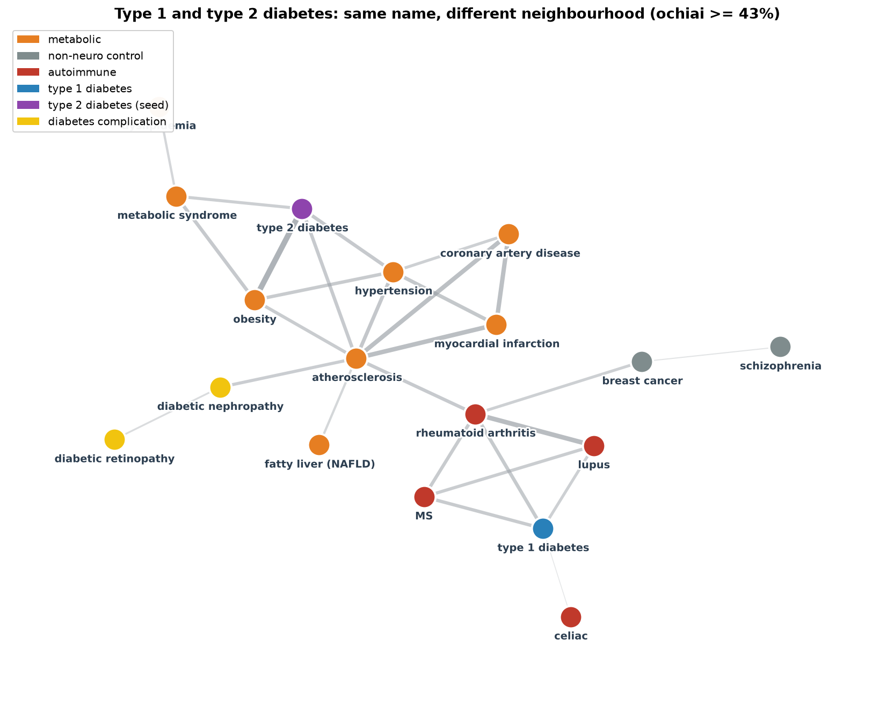

# Type 1 and type 2 diabetes: same name, different genetics

Type 1 and type 2 diabetes share a name but not a mechanism. This DBRetina workflow places type 1 with autoimmune
disease and type 2 with metabolic disease, from gene lists alone. Full write-up:
<https://dbretina.github.io/DBRetina/examples/diabetes-types/>

## Data

18 disorders from DisGeNET (Piñero et al., 2017): the two diabetes types, a metabolic group (obesity,
hypertension, metabolic syndrome, fatty liver, dyslipidaemia, coronary artery disease, atherosclerosis, myocardial
infarction), two diabetic complications, an autoimmune group (RA, lupus, celiac, MS), and two controls. In
`data/panel.gmt` (names prefixed `dis_`); categories in `data/labels.json`.

## Reproduce

```bash
conda activate dbretina
bash run.sh
```

`run.sh` builds the index and pairwise, draws the network with `graph` (type 2 in the metabolic cluster, type 1
in the autoimmune cluster), reads each type's nearest disorders with `module`, pulls the shared diabetes core with
`geneinfo`, and runs `analyze.py` for the autoimmune-vs-metabolic figure.

## Result

- **Type 2 diabetes' nearest disorders are all metabolic** (obesity, hypertension, atherosclerosis, metabolic
  syndrome); **type 1's are all autoimmune** (RA, MS, lupus).
- Type 1 is closer to the autoimmune group than the metabolic group (42% vs 35%); type 2 is the mirror image (43%
  metabolic vs 33% autoimmune).
- **They share a 969-gene glucose core** (INS, TCF7L2, GCK, KCNJ11), but type 1 adds the autoimmune HLA loci
  (HLA-DRB1, CTLA4, IL2RA, PTPN22) and type 2 adds the metabolic genes (PPARG, ADIPOQ, LEP, FTO).



## References

- Barrett JC, et al. Genome-wide association study and meta-analysis find that over 40 loci affect risk of type 1 diabetes. *Nature Genetics* 2009;41(6):703-707. https://doi.org/10.1038/ng.381
- Mahajan A, et al. Fine-mapping type 2 diabetes loci to single-variant resolution. *Nature Genetics* 2018;50(11):1505-1513. https://doi.org/10.1038/s41588-018-0241-6
- Piñero J, et al. DisGeNET. *Nucleic Acids Research* 2017;45(D1):D833-D839. https://doi.org/10.1093/nar/gkw943
