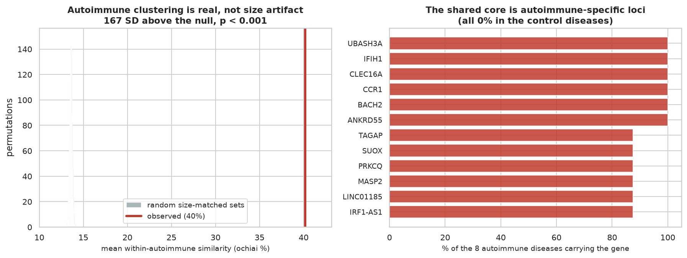

# Do autoimmune diseases share a genetic core?

A full DBRetina workflow, from a disease network down to the shared genes and a permutation test that proves the
result against a null model. Full write-up:
<https://dbretina.github.io/DBRetina/examples/autoimmune-diseases/>

## Question

Autoimmune diseases look unrelated in the clinic but are thought to share genetic risk (Cotsapas et al., 2011).
DBRetina finds that they cluster together. But any set of large gene lists overlaps somewhat just by size, so the
real question is: **is the autoimmune clustering more than a size artifact, and is the shared core specific
biology?**

## Data

16 diseases from DisGeNET (Piñero et al., 2017): 8 autoimmune, plus comorbidities and non-autoimmune controls.
In `data/diseases.gmt` (names prefixed `dis_`); categories in `data/labels.json`.

## Reproduce

```bash
conda activate dbretina
bash run.sh
```

`run.sh` chains the whole workflow: `index` and `pairwise` build the network; `export` draws the dendrogram;
`cluster` peels it to the tightest pairs ({Crohn's, UC} and {lupus, RA}) and pulls out the psychiatric module;
`module` reads rheumatoid arthritis's nearest diseases; `geneinfo` (run on the autoimmune diseases and on the
controls) gives the shared core; and `prove.py` runs the size-matched permutation test and writes the figure.

## Result

- **The clustering is not a size artifact.** Mean within-autoimmune ochiai is **40%**; a size-matched
  permutation null (2,000 random gene sets of the same sizes) sits at **13.6% ± 0.16**. The observed value is
  **167 standard deviations above the null (permutation p < 0.001)**. No random configuration comes close.
- **The shared core is autoimmune-specific loci.** The genes shared across the autoimmune diseases and absent
  from every control are known autoimmune-risk genes: UBASH3A, IFIH1, CLEC16A, CCR1, BACH2, ANKRD55 (all 8/8
  autoimmune, 0/3 controls), then TAGAP, PRKCQ, IL12RB2, IL37, HLA-DRB4, IRF1.



Honest note: only the *top* shared genes are strongly autoimmune-specific; the broader shared set includes common
disease genes. The permutation test is on the clustering itself, which is unambiguous.

## References

- Cotsapas C, et al. Pervasive sharing of genetic effects in autoimmune disease. *PLoS Genetics* 2011;7(8):e1002254. https://doi.org/10.1371/journal.pgen.1002254
- Piñero J, et al. DisGeNET. *Nucleic Acids Research* 2017;45(D1):D833-D839. https://doi.org/10.1093/nar/gkw943
