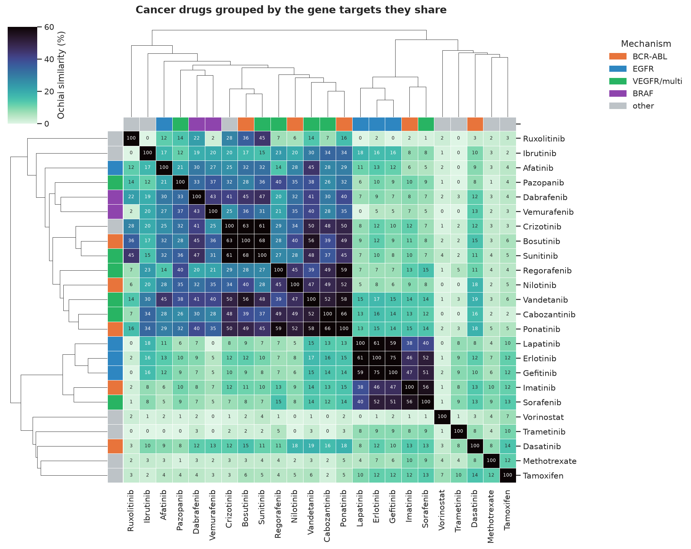

# Do drugs reveal their mechanism through shared targets?

A worked DBRetina use case. Full write-up:
<https://dbretina.github.io/DBRetina/examples/drug-repurposing/>

## Question

Do cancer drugs recover their mechanistic classes from their gene targets alone, and which cross-class overlaps
hint at repurposing?

## Data

24 cancer drugs and their target genes from DSigDB (Yoo et al., 2015). The extracted gene sets are in
`data/drugs.gmt`. To rebuild from the DSigDB source (`DSigDB_All.gmt`, gunzip it first), point `DSIGDB_GMT` at
your copy and run `build_data.py`.

## Reproduce

```bash
conda activate dbretina
bash run.sh
```

Runs `index`, `pairwise`, and `neighbors` (Sorafenib's target-sharing drugs), then regenerates the clustermap.

## Result

- The EGFR inhibitors form the tightest cluster (erlotinib / gefitinib share 75% of targets); the multi-kinase
  inhibitors form a broad block; vorinostat, methotrexate, and tamoxifen sit apart.
- Sorafenib shares 97 targets with imatinib and ~65 with the EGFR inhibitors, a cross-indication overlap of the
  kind repurposing screens look for.



## References

- Yoo M, et al. DSigDB: drug signatures database for gene set analysis. *Bioinformatics* 2015;31(18):3069-3071. https://doi.org/10.1093/bioinformatics/btv313
