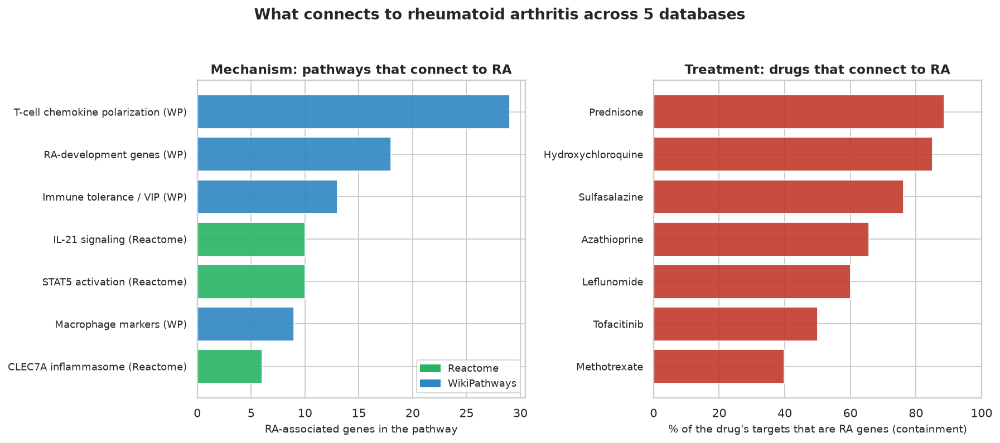

# What connects to a disease across five databases?

A worked DBRetina use case. Full write-up:
<https://dbretina.github.io/DBRetina/examples/multidb-rheumatoid/>

## Question

A single database only answers questions about its own contents. Combine several into one similarity network and
you can ask across them: what pathways (mechanism) and drugs (treatment) connect to rheumatoid arthritis?

## Data

Five databases in one index (~2,600 gene sets): DisGeNET diseases (Piñero et al., 2017), DSigDB drug targets
(Yoo et al., 2015), and KEGG (Kanehisa & Goto, 2000), Reactome (Gillespie et al., 2022), and WikiPathways
(Martens et al., 2021) pathways. The combined gene sets are in `data/multidb.gmt` (disease names prefixed `dis_`,
drugs `drug_`, pathways keep their source prefix). `build_data.py` shows how it was assembled from the sources.

## Reproduce

```bash
conda activate dbretina
bash run.sh
```

Runs `index` and `pairwise` (containment), then `neighbors` for rheumatoid arthritis, splitting the results into
pathways and drugs, and regenerates the figure.

## Result

- Mechanism: the pathways most contained in rheumatoid arthritis are immune/inflammatory (IL-21 signalling, STAT5
  activation, CLEC7A inflammasome, macrophage markers, T-cell chemokine polarisation).
- Treatment: the closest drugs are the standard antirheumatic drugs (prednisone, hydroxychloroquine,
  sulfasalazine, azathioprine, leflunomide, tofacitinib, methotrexate).



## References

- Piñero J, et al. DisGeNET. *Nucleic Acids Research* 2017;45(D1):D833-D839. https://doi.org/10.1093/nar/gkw943
- Yoo M, et al. DSigDB. *Bioinformatics* 2015;31(18):3069-3071. https://doi.org/10.1093/bioinformatics/btv313
- Kanehisa M, Goto S. KEGG. *Nucleic Acids Research* 2000;28(1):27-30. https://doi.org/10.1093/nar/28.1.27
- Gillespie M, et al. The Reactome pathway knowledgebase 2022. *Nucleic Acids Research* 2022;50(D1):D687-D692. https://doi.org/10.1093/nar/gkab1028
- Martens M, et al. WikiPathways: connecting communities. *Nucleic Acids Research* 2021;49(D1):D613-D621. https://doi.org/10.1093/nar/gkaa1024
