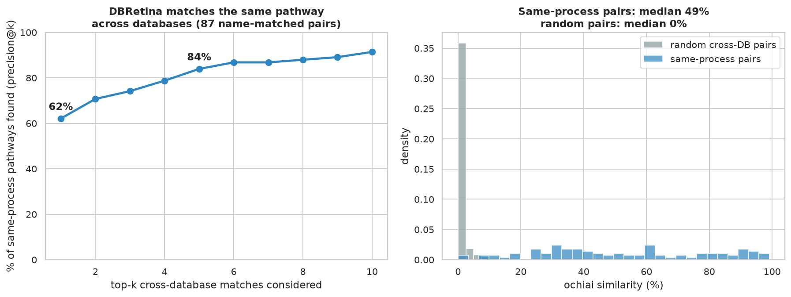

# Does the similarity metric actually work?

Two benchmarks that validate DBRetina's similarity, against ground truth and a baseline. Full write-up:
<https://dbretina.github.io/DBRetina/examples/validating-similarity/>

## Tests

1. **Cross-database pathway matching.** KEGG, Reactome, and WikiPathways are curated independently. For pathways
   carrying the same name across two of them, is the correct counterpart DBRetina's top match?
2. **Gene prediction vs frequency.** Does network-weighted voting predict a disease's genes better than a plain
   gene-frequency baseline (leave-one-disease-out)?

## Data

Uses the combined GMT from the [`integrative-network`](../integrative-network/) case study
(`../integrative-network/data/multidb.gmt`: DisGeNET diseases + KEGG/Reactome/WikiPathways pathways). Set the
`GMT` environment variable to point at another combined GMT.

## Reproduce

```bash
conda activate dbretina
python benchmark.py
```

## Result

- **Pathway matching:** across 87 same-named pathway pairs, the correct counterpart is DBRetina's **#1**
  cross-database match **62%** of the time and in the **top 5 84%** of the time. Same-process pairs share a median
  **49%** of genes; random cross-database pairs share **0%**. No frequency confound.
- **Gene prediction:** the network beats the gene-frequency baseline in **16/16 diseases** (mean +0.019 AUC,
  Wilcoxon p < 0.001). A small but consistent and significant gain.



## References

- Kanehisa M, Goto S. KEGG. *Nucleic Acids Research* 2000;28(1):27-30. https://doi.org/10.1093/nar/28.1.27
- Gillespie M, et al. The Reactome pathway knowledgebase 2022. *Nucleic Acids Research* 2022;50(D1):D687-D692. https://doi.org/10.1093/nar/gkab1028
- Martens M, et al. WikiPathways: connecting communities. *Nucleic Acids Research* 2021;49(D1):D613-D621. https://doi.org/10.1093/nar/gkaa1024
